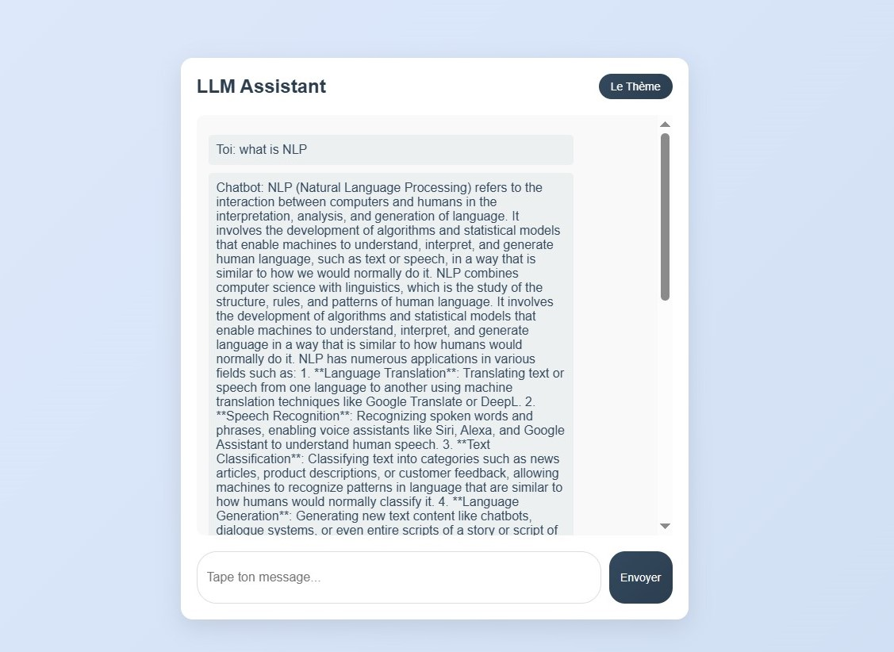

# 🤖 AI Chatbot with Local LLM (Ollama)

A conversational AI system powered by a local **LLM (Ollama)**, designed with FastAPI and a custom web interface. The project demonstrates end-to-end integration of LLMs into real-world applications.



---

## 🚀 Features

- Local LLM inference using Ollama (no API key needed)
- REST API built with FastAPI
- Clean chat web interface with dark/light theme
- Containerized deployment with Docker

---

## 🛠️ Tech Stack

- **Python** — core language
- **FastAPI** — REST API framework
- **Ollama** — local LLM runner
- **Docker** — containerized deployment
- **smollm:135m** — lightweight LLM model

---

## 🧠 Architecture

User → FastAPI Backend → Ollama (LLM) → Response → UI

---

## ⚙️ How to Run

### Option 1 — Without Docker

1. Install [Ollama](https://ollama.com) and pull the model:
```bash
   ollama pull smollm:135m
```

2. Install dependencies:
```bash
   pip install -r app/requirements.txt
```

3. Run the app:
```bash
   uvicorn app.app:app --host 0.0.0.0 --port 8000
```

4. Open browser at:
```bash
   http://localhost:8000/test
```
### Option 2 — With Docker

```bash
docker compose up
```
Then open `http://localhost:8000/test`

---

## 👩‍💻 Author

**Fatimazahra Namaoui** — Data & AI Engineering Student  
[](https://linkedin.com/in/fz-namaoui)
